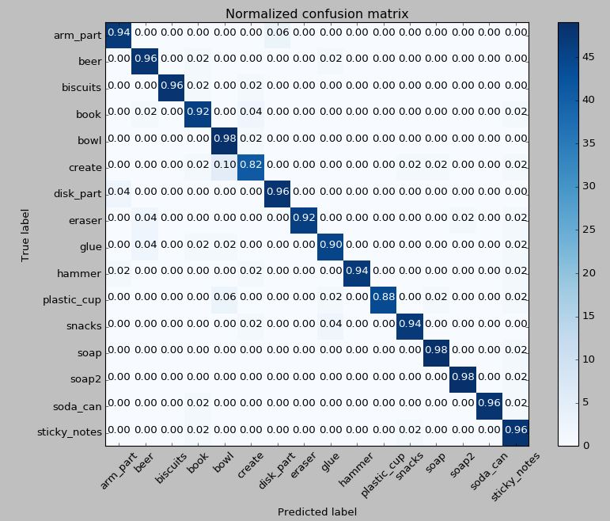
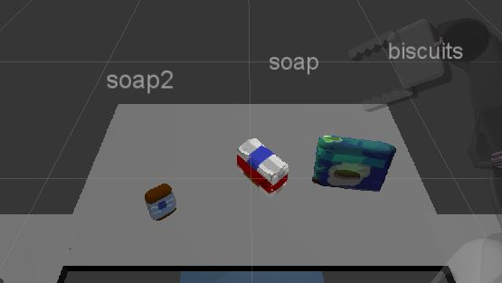
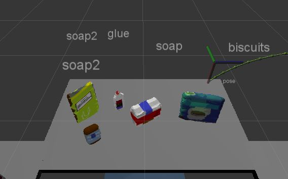
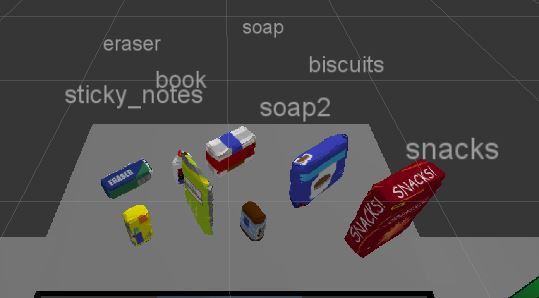

## Project: Perception Pick & Place
### Overview: 
The target of this project is to provide a Pick & Place solution for a PR2 robot running on Gazebo simulator over ROS. The robot, that is provided with RGB vision camera to allow identify a list of objects using a trained model, pick up a set of different objects and then place in two different boxes. 


---
The ROS environment has a set of 2 different configuration files: `pick_list_*.yaml` in `/pr2_robot/config` for a list of models to be identified and `test_*.world` in `/pr2_robot/worlds` to provide different scenerios.

1. To identify the objects, a serie of computer vision algorithms were used, where object features were extracted and trained a SVM model to detect objects, as follow:

- Features in Training Set: 800
- Invalid Features in Training set: 0
- Scores: [0.94375 0.89375 0.94375 0.95 0.95625]
- Accuracy: 0.94 (+/- 0.04)
- accuracy score: 0.9375

Running the `capture_feature.py` file, 50 features were captured for each object, totalizing 800 features. In sequence, the generated features file is used by `train_svm.py` file to train the object detection model. The figure below show the resulting prediction for the model.



Note that only two objects are below 0.90 that shows a good result.
Then we can use the `model.sav` trained file to recognize the objectes detect and manipulated by PR2 robot.

2. Write a ROS node and subscribe to `/pr2/world/points` topic. 

```Python
# Create Subscribers
pcl_sub = rospy.Subscriber("/pr2/world/points", pc2.PointCloud2, cl_callback, queue_size=1)
```
3. Use filtering and RANSAC plane fitting to isolate the objects of interest from the rest of the scene.
```Python
# RANSAC Plane Segmentation, will table and objects
seg = cloud_filtered.make_segmenter()
# Extract inliers and outliers
# set the model we wish to fit
seg.set_model_type(pcl.SACMODEL_PLANE)
seg.set_method_type(pcl.SAC_RANSAC)
max_distance = 0.05
# set max distance for a point to be considered fitting the model
seg.set_distance_threshold(max_distance)
# call the segment function to obtain set of inlier indices and model coefficients
inliers, coefficients = seg.segment()
# extracted inliers -> table
pcl_table = cloud_filtered.extract(inliers, negative=False)
# extracted outliers -> objects
pcl_objects = cloud_filtered.extract(inliers, negative=True)
```
4. Now, apply Euclidean clustering to create separated clusters for individual items.
```Python
# Euclidean Clustering
white_cloud = XYZRGB_to_XYZ(pcl_objects)
tree = white_cloud.make_kdtree()
# Create Cluster-Mask Point Cloud to visualize each cluster separately
# create a cluster extraction object
ec = white_cloud.make_EuclideanClusterExtraction()
# Set tolerances for distance threshold
# as well as minimum and maximum cluster size (in points)
ec.set_ClusterTolerance(0.05)
ec.set_MinClusterSize(50)
ec.set_MaxClusterSize(100000)
# Search the k-d tree for clusters
ec.set_SearchMethod(tree)
# Extract indices for each of the discovered clusters
cluster_indices = ec.Extract()
```
5. Perform object recognition on these objects and assign them labels (markers in RViz).
```Python
# Publish a label into RViz
label_pos = list(white_cloud[pts_list[0]])
label_pos[2] += .4
object_markers_pub.publish(make_label(label,label_pos, index))
```
6. Calculate the centroid (average in x, y and z) of the set of points belonging to that each object.
```Python
def grab_obj_info(object_list):
    labels = []
    centroids = []
    for obj in object_list:
        labels.append(obj.label)
        # Get the PointCloud for a given object and obtain it's centroid
        points_arr = ros_to_pcl(obj.cloud).to_array()
        # Create 'place_pose' for the object
        centroids.append(np.mean(points_arr, axis=0)[:3])
    return labels, centroids
```
7. Create ROS messages containing the details of each object (name, pick_pose, etc.) and write these messages out to `.yaml` files, one for each of the 3 scenarios (`test1-3.world` in `/pr2_robot/worlds/`).  See the example `output.yaml` for details on what the output should look like.
```Python
# Create a list of dictionaries (made with make_yaml_dict()) for later output to yaml format
yaml_dict = make_yaml_dict(test_scene_num, arm_name, object_name, pick_pose, place_pose)
dict_list.append(yaml_dict)
# Wait for 'pick_place_routine' service to come up
rospy.wait_for_service('pick_place_routine')
```  
8. Submit a link to your GitHub repo for the project or the Python code for your perception pipeline and your output `.yaml` files (3 `.yaml` files, one for each test world).  You must have correctly identified 100% of objects from `pick_list_1.yaml` for `test1.world`, 80% of items from `pick_list_2.yaml` for `test2.world` and 75% of items from `pick_list_3.yaml` in `test3.world`.

### Putting all together

Scenario 1. We have 3 objects: biscuits, soap, soap2. The figure shows the model prediction about the objects.



Scenario 2. We have 5 objects: biscuits, soap, soap2, glue, book. The figure below shows the model prediction for the objects.



Note that the model failed to recognize the book.

Scenario 3. We have 8 objects: biscuits, soap, soap2, glue, book, sticky_notes, snacks, eraser. The figure below shows the model prediction for the objects.



The model failed to regocnize the glue, but note that tht glue object is partially oclused by the book, which make things more difficult.

### Conclusions

- The code was devided in sections what did the things easier to understand, implement and test. It was possible test each part individually and at final, add all together.
- I had big problems with Euclidean Clustering because, depending on how you choose the parameters, you might create a dataset that will cause error when you try to process the prediction. I spent a good time until figure out the correct set of parameters to avoid problems ahead.
- Another point to take care is that the project can deal with RGB or HSV objects but I got better results using HSV option.
- For future optimization, we can provide a better trained model, for instance, using more training features.
- Another suggestion for improvement could be use a Neural Network model trained with the entire set of objects and then use the trained model with the robot.